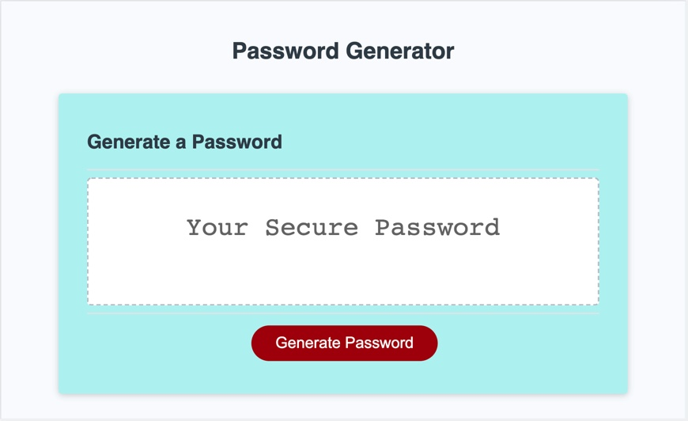

# Password-Generator


## Creation
```
This task was to create a password generator using Javascript using learning from week 3.

```

## Poduct
```

This password generator randomly generates a stong password based on criteria set by the employee.
 
Staff have the option to choose the length of the password and whether they would like to include other characters in the password.


```

## Screenshots





## Acknowledgements

```
The Super Sunday Sprint Team

```

## Version 
```
1.0 2022
```

## Licence
```
Creative Commons
```